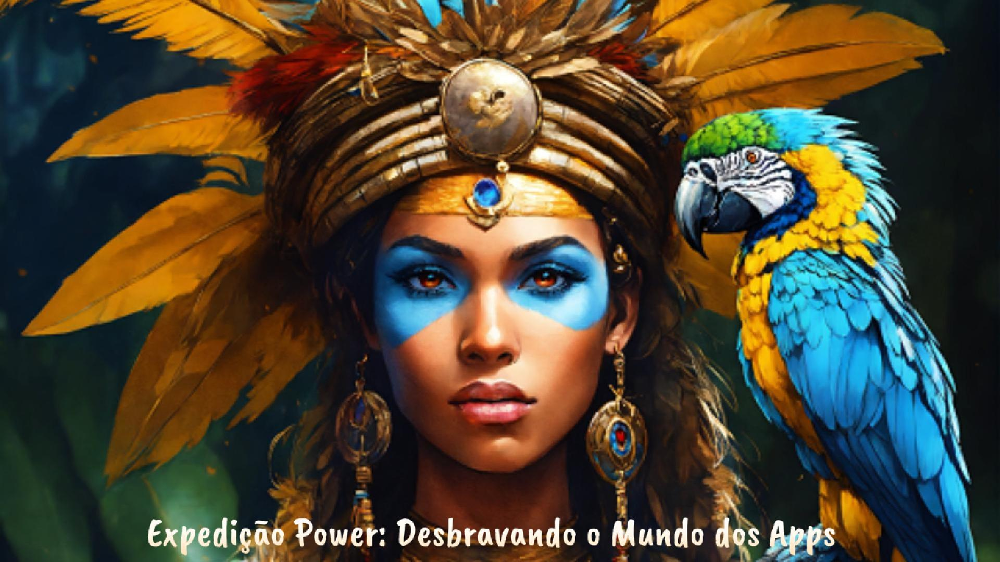

    <audio src="output/Podcast_finalizado.mp4" controls title="Podcast versão final"></audio>
#    <a href="https://github.com/Reistaboada/prompts-for-podcast-generate-by-ia/tree/main/output"> Clique aqui para acessar o podcast</a> 

# Projeto Podcast Gerado por I.A.s

Projeto com o objetivo de gerar um podcast utilizando ferramentas de IA através de prompts mais trabalhado.

Foram  utilizados prompts para gerar a imagem de capa e o conteúdo do podcast 

## 💻 Tecnologias utilizadas no projeto

- [ChatGPT](https://chat.openai.com/) - utilizado para gerar o título e o roteiro do  podcast
- [Lexica.art](https://lexica.art/) - utilizado para gerar a capa
- [TTSMAKER](https://ttsmaker.com/br) - utilizado para gerar o áudio original do podcast
- [Capcut](https://www.capcut.com/pt-br/) - utilizado para tratar o áudio e adicioar os efeitos sonoros.

## ✨ Etapas da elaboração do Podcast

1) Geração do Tìtulo pelo ChatGPT
2) Geração do roteiro pelo ChatGPT
3) Geração da capa pelo Lexica.art
4) Edição do áudio com a adição dos efeitos sonoros pelo Capcut

## 📚 Materiais

- [Link da live no Youtube](https://www.youtube.com)
- [Notion Template](https://helpful-jump-17b.notion.site/PAS-Podcast-AI-Studio-210489e15d7a4a73b743bb159e45d06f?pvs=4)
- [Editor de aúdio](https://www.capcut.com/editor?from_page=landing_page&__action_from=picture_V%C3%ADdeos%20profissionais%20em%20minutos,%20n%C3%A3o%20em%20horas.)

## 🛠️ Instruções de execução

-  . Use os prompts de roteiro no `chagpt`
-  . Use os prompts de roteiro gerados pelo chatgpt no  `ElevenLabs`
-  . Use os prompts de artes no `Lexica.art`

---

⌨️ por [Fabiana Taboada](https://github.com/Reistaboada)

